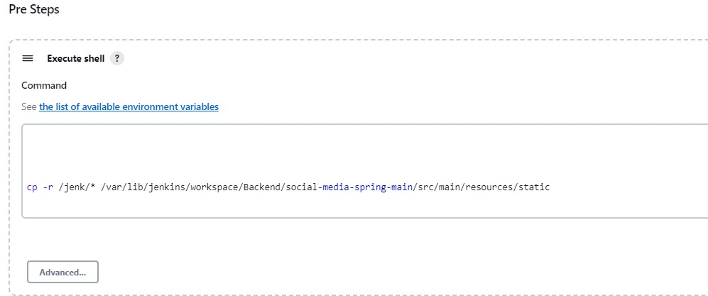

# Startup

The frontend of this project can be run either locally or remotely.

<h3>To run locally:</h3>
<ol type="1">
  <li>Make sure Node.js and TypeScript are installed correctly on your machine. There are several ways to achieve this.</li>
  <li>Navigate to the <code>src/</code> folder and run <code>npm install</code> in the command line.</li>
  <li>Next, run <code>npm start</code> in the command line. This will start the frontend.</li>
  <li>The frontend can be visited at <a href="http://localhost:4200/">http://localhost:4200/</a>.</li>
</ol>
<em>Note that the backend must be running in order for the frontend to function. Refer to the backend repository's STARTUP.md.</em>

<h3>To run remotely:</h3>
<ol type="1">
<li>Have an EC2 instance set up.</li>
<li>Have a Jenkins Pipeline created.</li>
<li>Take note of where on the EC2 Jenkins builds the Agular Project.</li>
<li>Have Jenkins move the contents of the Angular build folder into the SpringBoot Projects <code>/src/main/resources/static</code> folder before Jenkins builds the SpringBoot Project.</li>
<ul>
<li>This is done in Pre-Steps on Jenkins.</li>

</ul>
<li>Once Jenkins has completed the SpringBoot build and deployed it to the EC2 (Read the <code>STARTUP.md</code> file in the SpringBoot section for those instructions) the Angular application will be accessible through whichever port the SpringBoot application is set to run on, for example: <em>http://[EC2Address]:8081</em>.</li>
</ol>
